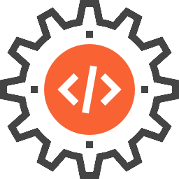

<div align="center">
  <h1>LPD Compiler</h1>
  
</div>

---

<div align="center">

### Tech Stack and Tools


</div>

<details>
  <summary>Table of Contents</summary>
  <ol>
    <li>
      <a href="#overview">Overview</a>
    </li>
    <li>
      <a href="#features">Features</a>
    </li>
    <li>
      <a href="#installation">Installation</a>
    </li>
    <li>
      <a href="#usage">Usage</a>
    </li>
    <li>
      <a href="#license">License</a>
    </li>
    <li>
      <a href="#documentation">Documentation</a>
    </li>
  </ol>
</details>

## Overview

The **LPD Compiler** is designed for the Didactic Programming Language (LPD), a structured language aimed at educational purposes. The compiler implements all phases of compilation, including lexical analysis, syntax analysis, semantic analysis, code generation, and optimization. It outputs executable code for a virtual machine defined as part of the project.

## Features

- **Full Compilation Pipeline**:

  - Lexical Analysis (Tokenization).
  - Syntax Analysis (Parsing).
  - Semantic Analysis with Symbol Table Management.
  - Intermediate and Target Code Generation.
  - Basic Code Optimization.

- **Some LPD Language Support**:

  - Core data types: `integer`, `boolean`.
  - Control structures: `if`, `while`.
  - Functions and Procedures.
  - Input/Output (`read`, `write`).

- **Error Handling**:

  - Identifies lexical, syntax, and semantic errors.
  - Graceful recovery and error reporting.

- **Virtual Machine**:
  - Executes the generated code.
  - Includes support for stack-based memory management.

## Installation

### Prerequisites

- GCC (C Compiler).
- GTK (for GUI).

### Building the Compiler

1. Clone this repository:

   ```bash
   git clone https://github.com/pedrodcarvalho/compiler-development.git
   cd compiler-development
   ```

2. Build the compiler and virtual machine:

   ```bash
   gcc compiler.c -o compiler `pkg-config --cflags --libs gtk+-3.0`
   gcc virtual_machine.c -o virtual_machine `pkg-config --cflags --libs gtk+-3.0`
   ```

   Since GTK code for the application was written with GTK's Toolkit for Linux, the compiled executables for Unix-based systems are already provided in the `dist/` directory.
   If you are using Windows or MacOS, please refer to this link for cross-compilation: [GTK Cross-Compilation](https://nandakumar.org/blog/2023/06/cross-compile-gtk-apps-for-windows.html).

## Usage

### Running the Compiler

Compile an LPD source file using:

```bash
./dist/compiler
```

### Running the Virtual Machine

Execute the compiled program:

```bash
./dist/virtual_machine
```

> - In both cases, the GUI will open up, allowing you to select the input file and view the output. <br>
> - When running the compiler (code editor), you need to input a file with LPD code in it. <br>
> - The compiler will generate the output (.obj) file with the compiled code. <br>
> - You can then run the virtual machine (code executor) with the compiled code file as input.

## License

This project is licensed under a proprietary License. See the [LICENSE](LICENSE) file for more information.

## Documentation

### LPD Language Highlights

- **Structured Syntax**: Programs follow a strict structure with keywords like `programa`, `var`, `inicio`, `fim`.
- **Functions and Procedures**: Modularize code for reusability, allowing recursion.
- **Variable Scope**: Supports global and local variables.

Example program in LPD to calculate the factorial of a number:

```lpd
programa factorial;
  var x, y: inteiro;

  procedimento p;
    var z: inteiro;

    inicio
      z := x;
      x := x - 1;

      se z > 1
      entao
        p
      senao
        y := 1;

      y := y * z
    fim;

  inicio
    leia(x);
    p;
    escreva(y)
  fim.
```

> You can find this example inside the `/assets` directory.

### Compiler Architecture

1. **Lexical Analysis**:

   - Tokenizes input code.
   - Recognizes keywords, identifiers, literals, and operators.

2. **Syntax Analysis**:

   - Parses tokens into a syntax tree.
   - Validates program structure against LPD grammar.

3. **Semantic Analysis**:

   - Type checking and scope validation.
   - Maintains a symbol table for identifiers.

4. **Code Generation**:

   - Generates intermediate and target code for the virtual machine.

5. **Virtual Machine**:
   - Executes generated code with stack-based instructions.

### Development Tools

- **Version Control**: Git.
- **Editor**: Visual Studio Code.

---

> For more detailed information, refer to the [PDF](./assets/compiler-documentation.pdf) documentation provided with the project. <br>
> There you will find a much more detailed explanation of the compiler's architecture, the LPD language, and the virtual machine.
